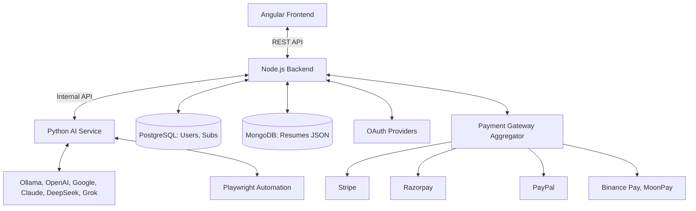

# JobSeeker v2 Design Document

## 1. Architecture Overview

The application will be a web-based global SaaS platform consisting of a Frontend and two Backend services, secured by Authentication and Payment layers. It is containerized using **Podman** for secure and daemonless deployment.

### Tech Stack
- **Frontend**: Angular (latest), built and managed with `bun`.
- **Backend Orchestrator**: Node.js (Express). Handles API requests, Authentication, Payments, file management, and orchestration.
- **AI & Automation Service**: Python (FastAPI). Handles heavy lifting:
    - **LLM Aggregator**: Connects to Ollama, OpenAI (GPT), Google (Gemma/Gemini), Anthropic (Claude), DeepSeek, xAI (Grok).
    - **Resume Parsing**: Parses Resume -> JSON.
    - **Job Scraping & Automation**: Playwright.
- **Databases**:
    - **PostgreSQL**: For relational data (Users, Subscriptions, Transactions, Job Applications).
    - **MongoDB**: For unstructured data (Parsed Resumes in JSON format, complex job descriptions).
- **Authentication**: Passport.js (supporting Google, LinkedIn, Outlook/Microsoft, GitHub) + Local Strategy.
- **Payments (Region-Aware)**:
    - **International (USD/EUR)**: Stripe, PayPal.
    - **India (INR)**: Razorpay (UPI, Netbanking).
    - **Crypto**: Binance Pay, MoonPay, USDT (Direct).
- **Infrastructure**: Podman & Podman Compose (or Kubernetes-ready pods).

### Diagram


## 2. User Interface (Frontend)

The application will feature a dynamic Landing/Login Page that detects or asks for Region.

### Pages
1.  **Landing / Auth Page**:
    - **Region Selector**: Top right (e.g., India, USA, Europe).
    - **Login/Signup**: SSO + Email.
2.  **Pricing / Subscription Page**:
    - Detects Region.
    - **India**: Shows ₹2000 INR -> Razorpay (UPI/Cards).
    - **USA/Global**: Shows $25 USD -> Stripe / PayPal.
    - **Crypto Mode**: Shows USDT/BTC -> Binance Pay / MoonPay.
3.  **Home / Dashboard** (Protected):
    - **LLM Selector**: Dropdown to choose which model to use (Local Ollama vs Cloud GPT-4 vs Claude vs DeepSeek).
    - Cards for tools.
4.  **Resume Optimizer**:
    - **Upload**: Parse -> Save JSON to MongoDB.
    - **Edit**: Edit fields directly (JSON Editor UI).
    - **Optimize**: Send JSON to selected LLM.
5.  **Custom Applier** & **Job Hunter**:
    - Similar flows, utilizing the selected LLM.

## 3. Backend Services

### A. Node.js Backend (Orchestrator)
- **Endpoints**:
    - `/api/auth/*`
    - `/api/payment/config`: Returns available gateways based on User Region.
    - `/api/payment/create`: Initiates payment.
    - `/api/resume/upload`: Uploads file -> Sends to Python -> Receives JSON -> Saves to MongoDB.
    - `/api/resume/:id`: Fetches JSON from MongoDB.
- **Data Stores**:
    - **PostgreSQL**: `Users`, `Subscriptions`, `Orders`.
    - **MongoDB**: `Resumes` (Collection).

### B. Python AI Service
- **LLM Module**:
    - Abstract Interface for LLMs.
    - **Providers**:
        - `Ollama` (Local).
        - `OpenAI` (API Key).
        - `Google` (Vertex/Gemini API).
        - `Anthropic` (Claude API).
        - `DeepSeek` (API).
        - `xAI` (Grok API).
- **Resume Parser**:
    - Converts PDF/Docx -> Structured JSON Schema.
- **Endpoints**:
    - `POST /parse_to_json`
    - `POST /generate`: Accepts JSON context + Prompt + Model Choice.

## 4. Features & Logic

### Feature 0: Region & Payments
- User selects Region.
- Frontend calls `/api/payment/config?region=IN`.
- Backend returns `{ currency: 'INR', gateways: ['razorpay', 'binance', 'moonpay'] }`.
- User pays.
- Subscription created in Postgres.

### Feature 1: Multi-LLM Support
- User can switch models in Settings or on the fly.
- "I want to use **DeepSeek Coder** for my technical resume" vs "**Claude 3 Opus** for my cover letter".
- Python service handles the routing.

### Feature 2: Resume as JSON (MongoDB)
- **Upload**: PDF -> Python parses to:
  ```json
  {
    "basics": { "name": "...", "email": "..." },
    "work": [ { "company": "...", "highlights": ["..."] } ],
    "skills": ["..."]
  }
  ```
- **Storage**: Saved in MongoDB.
- **Optimization**: The JSON is fed to the LLM to "Improve 'work' section".
- **Export**: JSON -> Rendered back to PDF.

## 5. Directory Structure
```
JobSeeker_v2/
├── frontend/          # Angular + Bun
├── backend-node/      # Node.js + Express
├── backend-python/    # Python FastAPI
├── database-postgres/ # SQL Scripts
├── database-mongo/    # Mongo Config
├── podman-compose.yml # Podman orchestration
├── Dockerfile.node    # (Compatible with Podman build)
├── Dockerfile.python
└── README.md
```
